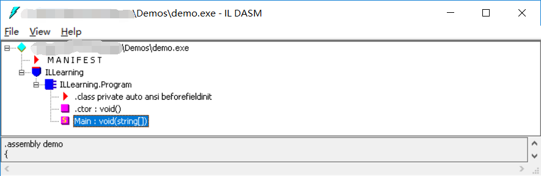

## 入门
### IL是什么？

IL（Intermediate Language），它也称为CIL或者MSIL，中文就是“中间语言”。IL由ECMA组织（ECMA-335标准）提供完整的定义和规范。我们可以直接把C#源码编译为.exe或dll文件，但是此时编译出来的程序代码并不是CPU能直接执行的二进制代码，而是IL代码。

### IL分析工具，如何使用？

#### 工具

1. ILDasm.exe

~~~
# 寻找路径
+ C:\Program Files (x86)\Microsoft SDKs\Windows\v10.0A\bin\NETFX x.x Tools
# 官方文档
+ https://docs.microsoft.com/en-us/dotnet/framework/tools/ildasm-exe-il-disassembler
~~~
#### ILDasm.exe说明

##### 1. 可视化分析

1.  编写常见的HelloWorld，*没有复杂的代码*。

~~~c#
using System;

namespace ILLearning
{
    class Program
    {
        static void Main(string[] args)
        {
            string helloString = "Hello World";
            Console.WriteLine(helloString);
            Console.ReadLine();
        }
    }
}
~~~

2. 使用csc.exe编译，具体可以参考：[C#命令行编译器的步骤介绍](https://www.cnblogs.com/mq0036/archive/2012/12/25/2832389.html)

3. 运行ILDasm.exe，拖刚刚编译的exe进来，界面如下：

   

> 从上图可以看到IL结构：包含MANIFEST文件和ILLearning，其中MANIFEST是一个清单文件，主要包括程序集的一些属性，例如程序集名称、版本号、哈希算法、程序集模块，以及对外部引用程序的引用项目。.Program类是我们要主要介绍的内容。

##### 2. 命令行操作

1. 常见命令

   ~~~shell
   > ildasm MyFile.exe /output:MyFile.il
   ~~~

#### IL指令

- [中文参考](http://www.cnblogs.com/flyingbirds123/archive/2011/01/29/1947626.html "飞鸟无限，博客园")

- [MSDN Ref](https://docs.microsoft.com/en-us/dotnet/api/system.reflection.emit.opcodes?view=netframework-4.7.2#remarks)

  + Emit实践

    ~~~C#
    using System;
    using System.Reflection;
    using System.Reflection.Emit;
    
    namespace ILLearning
    {
        class EmitTest
        {
            static void Main(string[] args)
            {
                #region Emit练习
                // specify a new assembly name 
                var assemblyName = new AssemblyName("World");
                // create assemblybuilder
                /*
                * AssemblyBuilderAccess枚举值说明：
                * AssemblyBuilderAccess.Run; 表示程序集可被执行，但不能被保存。　　
                * AssemblyBuilderAccess.Save; 表示程序集可被保存，但不能被执行。　　
                * AssemblyBuilderAccess.RunAndSave; 表示程序集可被保存并能被执行。
                * AssemblyBuilderAccess.ReflectionOnly; 表示程序集只能用于反射上下文环境中，不能被执行。　
                * AssemblyBuilderAccess.RunAndCollect; 表示程序集可以被卸载并且内存会被回收。
                * 
                 */
                var assemblyBuilder = AppDomain.CurrentDomain.DefineDynamicAssembly(assemblyName, AssemblyBuilderAccess.RunAndSave);
                // create module builder 
                var moduleBuilder = assemblyBuilder.DefineDynamicModule("WorldModule", "HelloWorld.exe");
    
                // create type builder for a class Name
                var typeBuilder = moduleBuilder.DefineType("HelloWorld", TypeAttributes.Public);
    
                // create method buider
                var methodBuilder = typeBuilder.DefineMethod("SayHello", MethodAttributes.Public | MethodAttributes.Static, null, null);
    
                // get il genereator
                var il = methodBuilder.GetILGenerator();
    
                il.Emit(OpCodes.Ldstr, "Hello，World");
                il.Emit(OpCodes.Call, typeof(Console).GetMethod("WriteLine", new Type[] { typeof(string) }));
                il.Emit(OpCodes.Call, typeof(Console).GetMethod("ReadLine"));
                il.Emit(OpCodes.Pop);
                il.Emit(OpCodes.Ret);
    
                var helloworldClassType = typeBuilder.CreateType();
                assemblyBuilder.SetEntryPoint(helloworldClassType.GetMethod("SayHello"));
    
                assemblyBuilder.Save("HelloWorld.exe");
    
                #endregion
                Console.WriteLine(
                         "Hi, a Hello Emit assembly has been generated for you.");
                Console.ReadLine();
            }
        }
    }
    ~~~

    

## 深化

> 读懂基础的IL，在实际开发中应用，**具体实践，留坑先**  

### 读懂IL

1. 读懂加减法的IL

~~~c

//  Microsoft (R) .NET Framework IL Disassembler.  Version 4.7.2053.0
//  Copyright (c) Microsoft Corporation.  All rights reserved.

// Metadata version: v4.0.30319
.assembly extern mscorlib
{
  .publickeytoken = (B7 7A 5C 56 19 34 E0 89 )                         // .z\V.4..
  .ver 4:0:0:0
}
.assembly demo // 指定程序集的名称
{
  .custom instance void [mscorlib]System.Runtime.CompilerServices.CompilationRelaxationsAttribute::.ctor(int32) = ( 01 00 08 00 00 00 00 00 ) 
  .custom instance void [mscorlib]System.Runtime.CompilerServices.RuntimeCompatibilityAttribute::.ctor() = ( 01 00 01 00 54 02 16 57 72 61 70 4E 6F 6E 45 78   // ....T..WrapNonEx
                                                                                                             63 65 70 74 69 6F 6E 54 68 72 6F 77 73 01 )       // ceptionThrows.

  // --- The following custom attribute is added automatically, do not uncomment -------
  //  .custom instance void [mscorlib]System.Diagnostics.DebuggableAttribute::.ctor(valuetype [mscorlib]System.Diagnostics.DebuggableAttribute/DebuggingModes) = ( 01 00 07 01 00 00 00 00 ) 

  .hash algorithm 0x00008004  // 指定的hash算法
  .ver 0:0:0:0 // 指定程序集的版本
}
.module demo.exe // 指定组成程序集的模块名称，在此示例中，程序集中只包含一个文件
// MVID: {61F485FC-2FB2-46D9-B2EE-29E5F44AF6CA}
.imagebase 0x00400000
.file alignment 0x00000200
.stackreserve 0x00100000
.subsystem 0x0003       // WINDOWS_CUI //指定程序要求的应用程序环境。在此示例中，0x0003表示该可执行文件从控制台运行
.corflags 0x00000001    //  ILONLY // 当前是元数据中的一个保留字段
// Image base: 0x05610000

// =============== CLASS MEMBERS DECLARATION ===================
/*
.class表示的Program是一个类，extends 代表Program类继承于程序集mscorlib中的System.Object类，这就告诉我们，在C#中所有的类的父类都是Object。
private为访问权限，表明该类是私有的。
auto：表明程序加载的时候内存布局是有CLR决定的，而不是由程序本身控制的。
ansi:表明类的编码为ansi编码
beforefieldinit ：表明CLR可以在第一次访问静态字段之前的任何时刻执行类型构造函数。类型构造函数也就是构造函数，而使用beforefieldinit属性可以提高性能。
*/
.class private auto ansi beforefieldinit ILLearning.Program
       extends [mscorlib]System.Object
{

  // main函数
  // cil managed 表明方法体中的代码是IL代码，且是托管代码，即运行在CLR运行库中的代码
  // hidebysig ：指令表示如果当前类作为父类，用该指令标记的方法将不会被子类继承
  .method private hidebysig static void  Main(string[] args) cil managed
  {
    // .entrypoint ：指令代表该函数是程序的入口函数，每个托管应用程序都有且只有一个入口函数，CLR加载的时候，首先从.entrypoint函数开始执行。
    .entrypoint
    // Code size       34 (0x22)
    // .maxstack 表明执行构造函数时，评估堆栈可容纳数据项的最大个数。评估堆栈是保存方法中所需变量的值的一个内存区域，该区域在方法执行结束时会被清空，或者存储一个返回值
    .maxstack  2
    // .locals init ([0] string helloString) 表示定义string 类型的变量，变量名成为：helloString
    .locals init (int64 V_0,
             int32 V_1,
             float32 V_2,
             int64 V_3)
    // IL_0000是代码行的开头。一般在IL_标记之前的部分为变量的声明和初始化操作。
    // IL_0000: nop 表示不做任何操作 No Operation
    IL_0000:  nop
    // （以ld为前缀的指令表示：入栈操作  st为前缀的指令则代表着出栈操作）
    IL_0001:  ldc.i4.0 // 将整数值 0 作为 int32 推送到计算堆栈上。
    IL_0002:  conv.i8 // 将位于计算堆栈顶部的值转换为 int64。
    IL_0003:  stloc.0 // 从计算堆栈的顶部弹出当前值并将其存储到索引 0 处的局部变量列表中。
    IL_0004:  ldc.i4.2
    IL_0005:  stloc.1
    IL_0006:  ldc.r4     1. // 将所提供的 float32 类型的值作为 F (float) 类型推送到计算堆栈上。
    IL_000b:  stloc.2 
    IL_000c:  ldloc.0 //将索引 0 处的局部变量加载到计算堆栈上。 // 拿出a的值 
    IL_000d:  ldloc.1 // 拿出b的值
    IL_000e:  conv.i8 // 将b强制转换成long类型
    IL_000f:  add // 相加
    IL_0010:  ldloc.2
    IL_0011:  conv.i8
    IL_0012:  add
    IL_0013:  stloc.3
    IL_0014:  ldloc.3
    // call :指令表示调用静态函数， 这里调用的是Console类中的WriteLine函数，把第0个局部变量输出到控制台中
    IL_0015:  call       void [mscorlib]System.Console::WriteLine(int64)
    IL_001a:  nop
    IL_001b:  call       string [mscorlib]System.Console::ReadLine()
    IL_0020:  pop
    IL_0021:  ret // 返回
  } // end of method Program::Main

// 默认的构造函数，其中.ctor 表示构造函数
  .method public hidebysig specialname rtspecialname 
          instance void  .ctor() cil managed
  {
    // Code size       8 (0x8)
    .maxstack  8
    IL_0000:  ldarg.0
    IL_0001:  call       instance void [mscorlib]System.Object::.ctor()
    IL_0006:  nop
    IL_0007:  ret
  } // end of method Program::.ctor

} // end of class ILLearning.Program

// =============================================================

// *********** DISASSEMBLY COMPLETE ***********************
// WARNING: Created Win32 resource file C:\Users\87953\Desktop\Demos\demo.res

~~~

2. 带有if分支的IL分析

~~~c

//  Microsoft (R) .NET Framework IL Disassembler.  Version 4.7.2053.0
//  Copyright (c) Microsoft Corporation.  All rights reserved.

// Metadata version: v4.0.30319
.assembly extern mscorlib
{
  .publickeytoken = (B7 7A 5C 56 19 34 E0 89 )                         // .z\V.4..
  .ver 4:0:0:0
}
.assembly demo
{
  .custom instance void [mscorlib]System.Runtime.CompilerServices.CompilationRelaxationsAttribute::.ctor(int32) = ( 01 00 08 00 00 00 00 00 ) 
  .custom instance void [mscorlib]System.Runtime.CompilerServices.RuntimeCompatibilityAttribute::.ctor() = ( 01 00 01 00 54 02 16 57 72 61 70 4E 6F 6E 45 78   // ....T..WrapNonEx
                                                                                                             63 65 70 74 69 6F 6E 54 68 72 6F 77 73 01 )       // ceptionThrows.

  // --- The following custom attribute is added automatically, do not uncomment -------
  //  .custom instance void [mscorlib]System.Diagnostics.DebuggableAttribute::.ctor(valuetype [mscorlib]System.Diagnostics.DebuggableAttribute/DebuggingModes) = ( 01 00 07 01 00 00 00 00 ) 

  .hash algorithm 0x00008004
  .ver 0:0:0:0
}
.module demo.exe
// MVID: {35CECF14-04D6-4E7E-AE4B-94F2DFB943BD}
.imagebase 0x00400000
.file alignment 0x00000200
.stackreserve 0x00100000
.subsystem 0x0003       // WINDOWS_CUI
.corflags 0x00000001    //  ILONLY
// Image base: 0x06EB0000

// =============== CLASS MEMBERS DECLARATION ===================

.class private auto ansi beforefieldinit ILLearning.Program
       extends [mscorlib]System.Object
{
  .method private hidebysig static void  Main(string[] args) cil managed
  {
    .entrypoint
    // Code size       50 (0x32)
    .maxstack  2
    .locals init (int64 V_0,
             string V_1,
             bool V_2)
    IL_0000:  nop
    IL_0001:  ldc.i4.3  // 将所提供的 int32 类型的值作为 int32 推送到计算堆栈上。
    IL_0002:  conv.i8 // 转换成long
    IL_0003:  stloc.0 // 出栈，赋值到a中
    IL_0004:  ldstr      "hello,kitty" // 字符串入栈
    IL_0009:  stloc.1  // 出栈，赋值给b
    IL_000a:  ldloc.0  // 	将索引 0 处的局部变量加载到计算堆栈上。
    IL_000b:  ldc.i4.5  // 将所提供的 int32 类型的值作为 int32 推送到计算堆栈上。
    IL_000c:  conv.i8
    IL_000d:  cgt
    IL_000f:  stloc.2
    IL_0010:  ldloc.2
    /*
    * Brfalse	如果 value 为 false、空引用（Visual Basic 中的 Nothing）或零，则将控制转移到目标指令。
    * Brfalse.S	如果 value 为 false、空引用或零，则将控制转移到目标指令。
    * Brtrue	如果 value 为 true、非空或非零，则将控制转移到目标指令。
    * Brtrue.S	如果 value 为 true、非空或非零，则将控制转移到目标指令（短格式）。
    */
    IL_0011:  brfalse.s  IL_0022

    IL_0013:  nop
    IL_0014:  ldstr      "hello world"
    IL_0019:  call       void [mscorlib]System.Console::WriteLine(string)
    IL_001e:  nop
    IL_001f:  nop
    /*
    * Br	无条件地将控制转移到目标指令。
    * Br.S	无条件地将控制转移到目标指令（短格式）。
    */
    IL_0020:  br.s       IL_002b

    IL_0022:  nop
    IL_0023:  ldloc.1
    IL_0024:  call       void [mscorlib]System.Console::WriteLine(string)
    IL_0029:  nop
    IL_002a:  nop
    IL_002b:  call       string [mscorlib]System.Console::ReadLine()
    IL_0030:  pop
    IL_0031:  ret
  } // end of method Program::Main

  .method public hidebysig specialname rtspecialname 
          instance void  .ctor() cil managed
  {
    // Code size       8 (0x8)
    .maxstack  8
    IL_0000:  ldarg.0
    IL_0001:  call       instance void [mscorlib]System.Object::.ctor()
    IL_0006:  nop
    IL_0007:  ret
  } // end of method Program::.ctor

} // end of class ILLearning.Program

// =============================================================

// *********** DISASSEMBLY COMPLETE ***********************
// WARNING: Created Win32 resource file C:\Users\87953\Desktop\Demos\demo2.res

~~~

3. const会给CLR变成static

~~~c

//  Microsoft (R) .NET Framework IL Disassembler.  Version 4.7.2053.0
//  Copyright (c) Microsoft Corporation.  All rights reserved.

// Metadata version: v4.0.30319
.assembly extern mscorlib
{
  .publickeytoken = (B7 7A 5C 56 19 34 E0 89 )                         // .z\V.4..
  .ver 4:0:0:0
}
.assembly demo
{
  .custom instance void [mscorlib]System.Runtime.CompilerServices.CompilationRelaxationsAttribute::.ctor(int32) = ( 01 00 08 00 00 00 00 00 ) 
  .custom instance void [mscorlib]System.Runtime.CompilerServices.RuntimeCompatibilityAttribute::.ctor() = ( 01 00 01 00 54 02 16 57 72 61 70 4E 6F 6E 45 78   // ....T..WrapNonEx
                                                                                                             63 65 70 74 69 6F 6E 54 68 72 6F 77 73 01 )       // ceptionThrows.

  // --- The following custom attribute is added automatically, do not uncomment -------
  //  .custom instance void [mscorlib]System.Diagnostics.DebuggableAttribute::.ctor(valuetype [mscorlib]System.Diagnostics.DebuggableAttribute/DebuggingModes) = ( 01 00 07 01 00 00 00 00 ) 

  .hash algorithm 0x00008004
  .ver 0:0:0:0
}
.module demo.exe
// MVID: {94F20870-93B0-42E9-8F35-6716A4FE3711}
.imagebase 0x00400000
.file alignment 0x00000200
.stackreserve 0x00100000
.subsystem 0x0003       // WINDOWS_CUI
.corflags 0x00000001    //  ILONLY
// Image base: 0x00C30000

// =============== CLASS MEMBERS DECLARATION ===================

.class private auto ansi beforefieldinit ILLearning.Program
       extends [mscorlib]System.Object
{
  .class auto ansi nested assembly beforefieldinit model
         extends [mscorlib]System.Object
  {
    // Const 会给转换成static
    .field public static literal int32 NUM = int32(0x00000003)
    .method public hidebysig specialname rtspecialname 
            instance void  .ctor() cil managed
    {
      // Code size       8 (0x8)
      .maxstack  8
      IL_0000:  ldarg.0
      IL_0001:  call       instance void [mscorlib]System.Object::.ctor()
      IL_0006:  nop
      IL_0007:  ret
    } // end of method model::.ctor

  } // end of class model

  .method private hidebysig static void  Main(string[] args) cil managed
  {
    .entrypoint
    // Code size       15 (0xf)
    .maxstack  8
    IL_0000:  nop
    IL_0001:  ldc.i4.3
    IL_0002:  call       void [mscorlib]System.Console::WriteLine(int32)
    IL_0007:  nop
    IL_0008:  call       string [mscorlib]System.Console::ReadLine()
    IL_000d:  pop
    IL_000e:  ret
  } // end of method Program::Main

  .method public hidebysig specialname rtspecialname 
          instance void  .ctor() cil managed
  {
    // Code size       8 (0x8)
    .maxstack  8
    IL_0000:  ldarg.0
    IL_0001:  call       instance void [mscorlib]System.Object::.ctor()
    IL_0006:  nop
    IL_0007:  ret
  } // end of method Program::.ctor

} // end of class ILLearning.Program

// =============================================================

// *********** DISASSEMBLY COMPLETE ***********************
// WARNING: Created Win32 resource file C:\Users\87953\Desktop\Demos\demo3.res

~~~

## 参考

1. [C#基础拾遗系列之一：先看懂IL代码](https://www.cnblogs.com/runningsmallguo/p/8440734.html "Code宝宝，博客园")